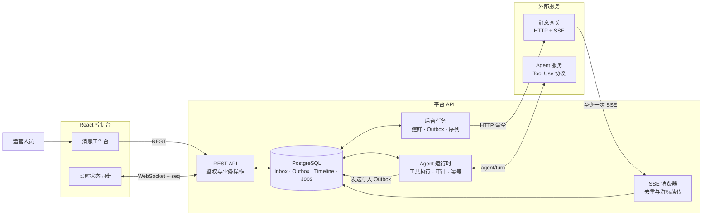
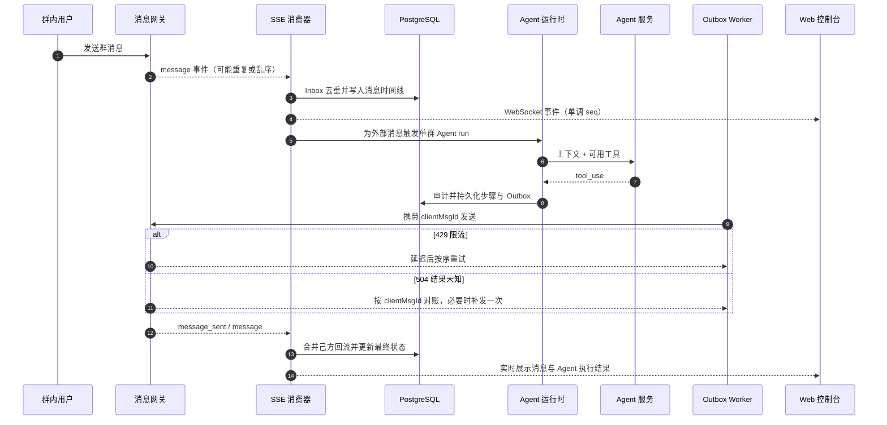

# 多账号群组消息管理平台

一个面向运营人员的多账号群聊工作台：统一管理服务账号、群组消息、定时任务与 Agent 自动应答。

项目采用 Node.js + TypeScript + PostgreSQL + React 18，并内置可注入故障的消息网关和 Agent 模拟服务。实现重点不是普通 CRUD，而是外部服务重复、乱序、限流、超时和断线时，系统仍能保持消息可追踪、任务可恢复、结果可对账。

> **在线演示：** [消息工作台](http://47.100.179.54:15173/) · [Swagger API](http://47.100.179.54:15173/docs/)
>
> 登录账号：`admin / admin`（读写）或 `viewer / viewer`（只读）。这是公开演示环境，数据可能被其他访问者修改。

**快速导航：** [快速开始](#快速开始) · [系统架构](#系统架构图) · [核心数据流](#核心数据流) · [关键设计](#关键设计) · [验收](#验收) · [完成范围](#完成范围)

## 快速开始

环境要求：Node.js 22+、pnpm 10+、Docker（含 Compose v2）。

```bash
pnpm install
make up
```

`make up` 会依次启动 PostgreSQL、执行数据库迁移，并运行 API、Web、Mock 网关和 Mock Agent。

| 服务          | 地址                            |
| ------------- | ------------------------------- |
| Web 控制台    | http://localhost:5173           |
| Swagger       | http://localhost:3000/docs      |
| OpenAPI JSON  | http://localhost:3000/docs/json |
| Mock 消息网关 | http://localhost:4001           |
| Mock Agent    | http://localhost:4002           |

演示账号：

- `admin / admin`：可读写
- `viewer / viewer`：只读；写接口会返回 `403`

控制台预置「小红助手 / 小明助手 / 小张助手」，也可新建服务账号。新账号初始状态为 `idle`，连接网关后才能参与建群和发消息。

## 已实现能力

- **服务账号管理**：账号创建、连接、离线、重连、释放，以及状态机并发保护。
- **群聊工作台**：多账号筛选、群列表、消息时间线、人工发消息、群成员与异常待处理状态。
- **可靠消息链路**：入站去重、己方消息合并、SSE 游标续传、outbox、限流恢复和 504 对账。
- **异步建群**：创建、邀请、等待成员加入、提升管理员和 Job 进度查询。
- **Agent 运行时**：读取上下文、发消息、移除成员、审计、幂等、运行预算和故障恢复。
- **自动任务**：定时序列、公共变量与逐步骤覆盖、预检、单群互斥和进度展示。
- **实时与会话**：WebSocket 断线补发、Refresh Token 轮换、重放失效与退出登录。
- **工程化**：Zod 共享契约、Swagger、Migration 版本保护、Git hooks、CI 和自动化验收脚本。

## 系统架构图



主链路实现入口：[业务模块](./apps/api/src/modules) · [网关事件消费](./apps/api/src/workers/gateway-events.ts) · [Outbox](./apps/api/src/workers/outbox.ts) · [Agent 运行时](./apps/api/src/workers/agent-runs.ts) · [定时序列](./apps/api/src/workers/sequences.ts) · [共享契约](./packages/contracts/src)

### 核心数据流



人工发送和定时序列也写入同一条 Outbox 链路，因此共享限流、对账、重试和状态回显能力。

### 仓库结构

```text
apps/
  api/             REST / WebSocket、PostgreSQL、后台任务
  web/             React 运营控制台
  mock-gateway/    支持故障注入的消息网关
  mock-agent/      Agent 协议与异常行为模拟
packages/
  contracts/       Zod Schema 与共享 TypeScript 类型
scripts/           场景验收脚本
deploy/            容器化部署配置
```

采用 pnpm monorepo，使 API、Web、Mock 服务与共享契约可以在一次变更中同步演进，同时仍可独立构建和部署。

## 关键设计

| 领域       | 实现                                                                            |
| ---------- | ------------------------------------------------------------------------------- |
| 账号状态   | 有限状态机 + CAS；进入终态时清理成员并取消排队消息                              |
| 入站消息   | `(groupId, msgId)` 去重；持久化 SSE 游标；己方回流合并原消息                    |
| 出站消息   | 先写 outbox 再调用网关；完整记录 `queued → accepted → sent/failed/unknown`      |
| 超时与限流 | `429` 延迟重试；`504` 进入 `unknown`，按 `clientMsgId` 对账后最多补发一次       |
| 建群       | 异步 Job 编排创建、邀请、加入和管理员提升；邀请未就绪或过期可重试               |
| 消息时间线 | `(sentAt, id)` keyset 分页；WebSocket 通过单调 `seq` 和 `sinceSeq` 补齐断线事件 |
| Agent      | 单群单 run；工具调用审计；run 内幂等；协议错误、步数和时长均有上限              |
| 定时序列   | 启动前解析变量来源并预检；同一群同时只允许一个序列运行                          |
| 登录会话   | HttpOnly Refresh Token 轮换；重放时整条会话失效；Logout 立即失效                |
| API 契约   | Zod 同时用于运行时校验、共享类型和 OpenAPI 文档                                 |

数据库迁移需显式执行 `pnpm db:migrate`。若数据库版本落后，API 会拒绝启动并提示迁移，避免带着不兼容 Schema 运行。

## 验收

先保持 `make up` 运行，再执行：

| 场景                     | 命令                   |
| ------------------------ | ---------------------- |
| S1 正常发送              | `pnpm scenario smoke`  |
| S2 重复事件              | `pnpm scenario s2`     |
| S3 己方消息回流          | `pnpm scenario s3`     |
| S4 限流恢复              | `pnpm scenario s4`     |
| S5 504 对账与 Agent 幂等 | `pnpm scenario s5`     |
| S6 Agent 异常响应        | `pnpm scenario s6`     |
| S7 序列并发互斥          | `pnpm sequence:verify` |
| S8 变量预检              | `pnpm sequence:verify` |

补充验收：

```bash
pnpm scenario agent              # Agent 完整工具调用链
pnpm auth:verify                 # Refresh / 重放 / Logout
pnpm group-lifecycle:verify      # 邀请与全员退出
pnpm account-concurrency:verify  # 账号并发状态转移
pnpm lab:verify                  # 控制台可靠性实验
```

脚本只通过公开 API 和 Mock 故障注入准备场景，不直接修改数据库伪造结果。

## 完成范围

| 需求                    | 状态   | 说明                                                 |
| ----------------------- | ------ | ---------------------------------------------------- |
| A0–A6                   | 已完成 | 基础能力、账号、网关、建群、时间线、Agent 与页面 1–3 |
| B1                      | 已完成 | 定时序列、变量预检与页面 5                           |
| B2                      | 已完成 | 邀请生命周期与 `leave-all`                           |
| B3                      | 已完成 | Refresh Token 轮换与退出登录                         |
| B4                      | 已完成 | WebSocket 断线补齐与 Agent 详情                      |
| C1 媒体文件             | 未实现 | 选做                                                 |
| C2 Claude / Gemini 服务 | 未实现 | 选做；下述 Qwen 接入为额外实验能力，不计入题目完成度 |
| C3 Playwright E2E       | 未实现 | 选做                                                 |

### 可选：使用真实模型

默认 Mock Agent 使用固定脚本，保证 S1–S8 可重复验收。配置 `DASHSCOPE_API_KEY` 后，可在保持 `/agent/turn` 工具协议不变的情况下切换到 Qwen；模型、地址和超时见 `.env.example`。

## 开发命令

```bash
pnpm build       # 生产构建
pnpm lint        # ESLint + TypeScript + Prettier
pnpm test        # 单元、契约与数据库集成测试
pnpm format      # 格式化
pnpm db:migrate  # 执行迁移
```

- `pre-commit`：对暂存文件执行 ESLint fix 与 Prettier。
- `pre-push`：执行 `pnpm lint && pnpm test`。
- GitHub Actions：使用 PostgreSQL 16 执行检查、构建、数据库迁移测试与全栈 Smoke 场景。
- 其他配置见 `.env.example`；非演示环境应设置 `DEMO_MODE=false`。
